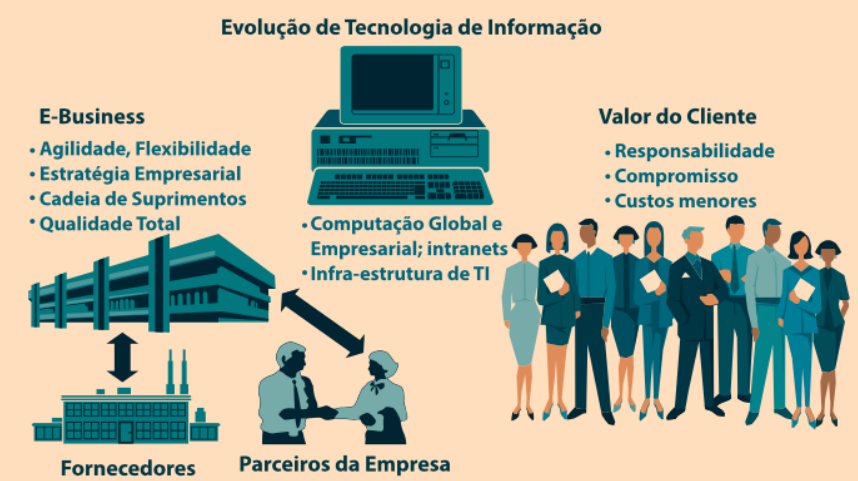
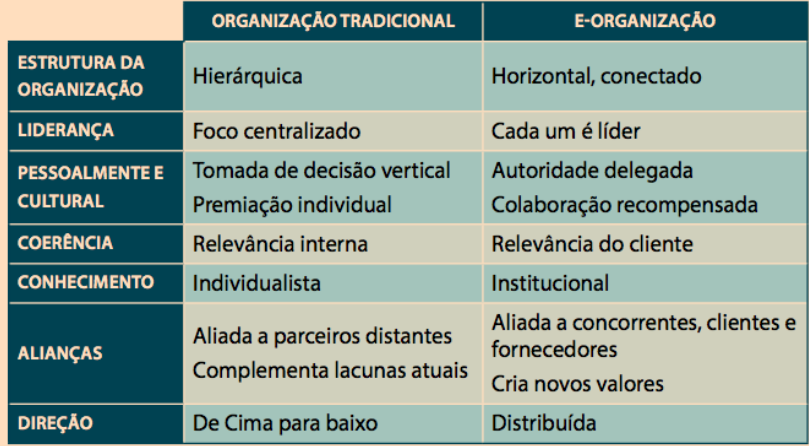
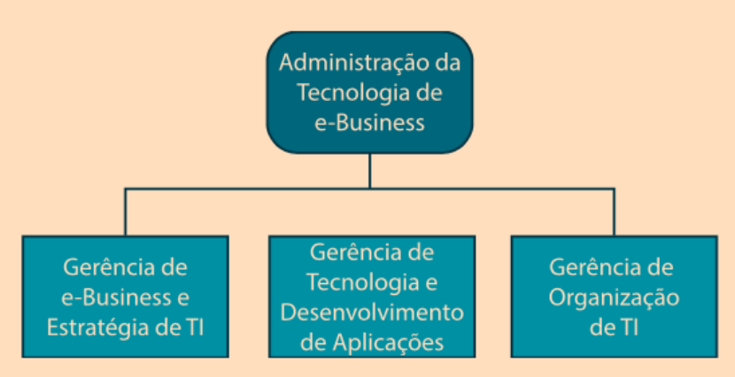
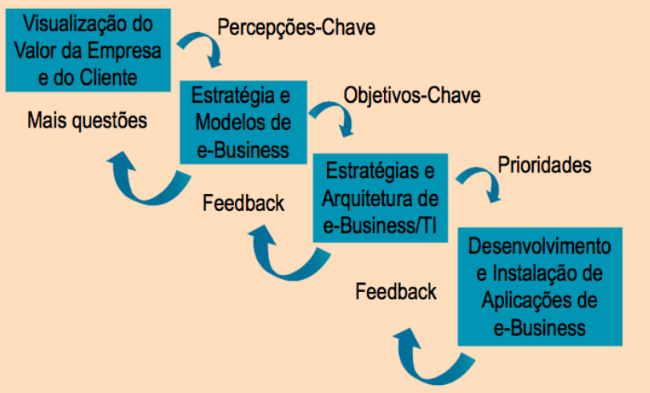

# Tópicos
- EB e a Tecnologia da
Informação;

- A Organização de EB;

- Administração da Tecnologia de EB.

# Objetivos

- Compreender a evolução dos processos de gerenciamento de EB;
  
- Identificar as fases do planejamento da implementação de EB;
  
- Verificar a importância do capital humano na administração das tecnologias de EB;
  
- Compreender a relação entre o EB e os processos de negócios da empresa.

A evolução da tecnologia da informação está relacionada aos avanços dos estudos nessa
área e também ao mercado em que as
empresas atuam, a competitividade e a
necessidade de estabelecer estratégias

# Fatores envolvidos na tecnologia de EB:

• Para investir em novas tecnologias as empresas precisam fazer um cruzamento entre:

• o que é economicamente viável;

• o que está acessível;

• o que é realmente necessário;

• o que pode ser integrado (máquinas,
sistemas, pessoas, operações,
tarefas etc.).

 Com este raciocínio, algumas
perguntas são levantadas.

## Perguntas relacionadas à tecnologia de EB:

- Qual será a **infraestrutura** necessária para atender à
estratégia da empresa, analisando os computadores
necessários para inserção de dados, assim como para
armazenamento das informações?

- Que **tipo de profissional** será necessário para o
acompanhamento dos dados inseridos no sistema, fazer auditorias, passar treinamento e acompanhar os
usuários?

- Quais tipos de **software e de banco de dados** serão
utilizados para os processos operacionais e
estratégicos da organização?

# Banco de dados:

- “coleção de informações que se relacionam de
modo que criem algum sentido” (SILVA, 2017).

- “é uma estrutura bem organizada de dados que permite a extração de informações” (SILVA, 2017).

- Se mostram como a peça mais importante de um sistema de informação.

Existem **programas** específicos para gerenciar e manipular dados em um sistema.

## Tipos de programas de gerenciamento de dados:

- **SQLServer**: um dos maiores do mundo (Microsoft);
  
- **MySQL**: software livre, com código fonte aberto;
  
- **FirebirdSQL**: possui código fonte aberto e roda na
maioria dos sistemas Unix;

- **Microsoft Access**: acompanha o pacote Office. Tem
poucas atribuições profissionais; mais usado para
aprendizagem, com interface amigável;

- **mSQL**: sistema pequeno e que trabalha mais com o uso
eficiente da memória.

# A Organização de E-Business

- Empresas tradicionais e
empresas com modelo de
negócio pautado na internet
possuem características
bastante distintas;

- As relações digitais estimulam a criação de novas
rotinas na cultura organizacional.

- Empresas tradicionais: estrutura vertical;
E-organização: estrutura horizontal.

## As 7 dimensões de uma organização:

##  As 7 características de uma e-organização:

- **E-commerce personalizado**: massificação da personalização;

- **Serviços offline**: produtos que outrora não eram comercializados pela internet, passam a ganhar
uma nova perspectiva (seguros, alimentos, mercado etc.);

- **Serviços baseados em redes sociais**:
plataformas sociais utilizadas
como estratégia de vendas;

- **Livros eletrônicos**: e-books;

- **E-learning**: ensino a distância, treinamentos, capacitações;

- **Geolocalização**: rastreabilidade dos usuários, integração do online e offline;

- **Leilões online**: modalidade
diferenciada de venda.

# Administração da Tecnologia de E-Business

## A abordagem gerencial de E-business possui 3 componentes essenciais:

- Administrar o desenvolvimento e a implementação em comum de **estratégias** de EB e tecnologia da
informação (TI);

- Administrar o desenvolvimento de **aplicações** de EB e a pesquisa e implementação de novas TI;

- Administrar os **processos**, **profissionais** e **subunidades** dentro da organização de TI e da
função de sistemas de informação na empresa.

## Estratégias para implementação de um EB

## Para que a implementação de um EB ocorra, é preciso articular os seguintes fatores:

- **Âmbito**: amplitude do projeto e recursos necessários;
  
- **Políticas**: políticas internas da organização, apresentação aos funcionários, períodos e formas
de desenvolvimento;

- **Coordenação**: gerenciamento das operações e das pessoas envolvidas no projeto
  
- **Subprojetos**: ramificações ou módulos do projeto devem sempre ser relacionados com a visão global
da empresa.

## Ainda, para desenvolver um projeto de EB podemos nos orientar por estes 8 passos:

1) Defina as tarefas;

2) Determine as principais aplicações do EB;
   
3) Defina o detalhamento dentro de um subprojeto;
   
4) Desenvolva um horário para todo o grupo de atividades;
   
5) Analise o plano do projeto;
   
6) Complete todas as fases do projeto;
   
7) Analise os horários para análise de projeto;
   
8) Apresente o plano para a equipe de trabalho.

## Ou seja, o desenvolvimento de um projeto de EB envolve:

• Planejamento;

• Organização;

• Estratégia;

• Tática;

• Cronograma;

• Delegação;

• Integração;

• Ação.

Lidar com TI envolve trabalhar com **áreas diversas**

## O responsável por um departamento de TI se depara diariamente com diversas áreas:

- **Aplicativos**: desenvolvimento, atualização e manutenção de aplicativos e softwares;
  
- **Serviços**: execução das atividades rotineiras e repetitivas, geralmente referenciadas como produção.
  
- **Recursos**: cuida de sistemas
operacionais, rede, planejamento de capacidade, instalação de equipamentos, etc.

##  Além do planejamento, os gestores devem se preocupar também com a arquitetura da informação, envolvendo:

- **Plataforma tecnológica**: equipamentos e redes que
apoiam o uso de um EB (internet, intranet, extranet, redes de comunicações etc.);

- **Recursos de dados**: referentes ao tipo de banco de
dados utilizado pela empresa;

- **Arquitetura de aplicações**: integração entre tecnologias utilizadas (integração de sistemas);
  
- **Organização da TI**: distribuição das funções e tarefas, sempre remetendo à missão e visão da
empresa.

Ou seja, a arquitetura da informação incide diretamente no planejamento e
organização dos dados de um
sistema de informação.

# Considerações Finais

• A evolução da TI depende do avanço científico, acadêmico e das evoluções mercadológicas;

• Organizações com modelo de negócio pautado na
internet possuem uma estrutura bastante distinta
das empresas tradicionais;

• Um projeto de EB exige trabalhar
com áreas diversas, ou seja,
demanda habilidade multidisciplinar;

• A organização e funções de um
banco de dados influencia na
condução de um negócio.
