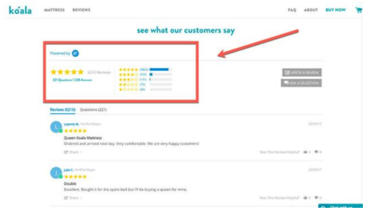
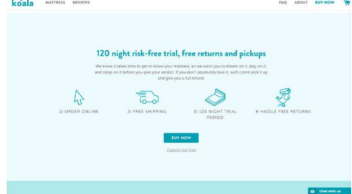
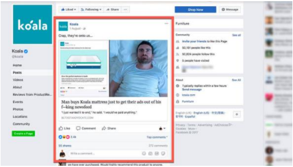

# Comércio Eletrônico

### Case b2c:

US $ 20 Milhões Em Negócios De
Cuidados Com A Pele Em 2 Anos,
Sem Experiência Em Beleza
por **Daily Mail**

Lançado com centenas de nano /
micro influenciadores de uma só
vez. Assumiu o Instagram com
modelos postando fotos
Forte rede de distribuição de
influenciadores com um público
caloroso e muito engajado
Peguei as tendências e depois
amplie-as por meio de
influenciadores

Como HiSmile Dominou A Geração Y e passou de um
pequeno investimento de 20mil para uma potencia de
ecommerce avaliado em 40 milhões em menos de 3 anos

Como HiSmile Dominou A
Geração Y e passou de
um pequeno
investimento de 20mil
para uma potencia de
ecommerce avaliado em
40 milhões em menos de
3 anos

De zero a $ 13 milhões em 12 meses - Estratégia de
crescimento do **Koala**

1. **Produto**

Eles se concentram em fazer com que
seus clientes publiquem uma avaliação online após a compra - Provavelmente é por meio de uma sequência de acompanhamento por
e-mail para clientes que compraram recentemente

2. **A oferta**
   
Ter uma oferta incrível é NECESSÁRIO para
colocar o produto **nas mãos do maior** **número possível de pessoas** - oferecem US $ 100 de desconto em sua compra

Pense em como colocar seu produto nas mãos de seus clientes para que eles possam experimentá-lo antes de comprá-lo, especialmente se você for uma empresa
de comércio eletrônico. Quanto mais fácil você fizer para as pessoas, mais você venderá - é simples assim.

3. **A propagando atrativa**

Publicar postagens regulares como
essa é ótimo para manter o público em mente.

Quando as pessoas pesquisam no
Google, elas estão no processo de tomar uma decisão de compra

4. **Apoio em sistemas de email Marketing**

Os e - mails são uma forma eficaz e de baixo custo de acompanhar os clientes que estão prontos para comprar. Utilizado corretamente (por exemplo, por meio de eventos baseados em tempo e em gatilhos), o
marketing por e-mail também pode ajudar a levar os clientes a uma decisão de compra.

O produto é INCRÍVEL; A oferta é FORTE; E o marketing está NO PONTO.

5. **Site**

Eles têm uma home page, uma única página de
produto e algumas outras páginas diversas que não são realmente necessárias para fazer a venda - A página inicial e a página do produto são bastante semelhantes.

A principal diferença é que a página inicial fala um pouco da Empresa e da Causa

Você não precisa de um grande site para ir de zero a $
13 milhões de receita em menos de 12 meses. Na
verdade, você só precisa de uma (talvez duas)
páginas. O resto é o produto, a oferta, o marketing e
como você comunica a mensagem em seu site.

Certifique-se de que seu processo de **checkout** seja
perfeito. Qualquer atrito no processo de checkout aumentará o abandono do carrinho e o custo das vendas. **Pós venda** ( indique um amigo) ; **Carregamento da página** – Google pageSpeed – 8 seg
