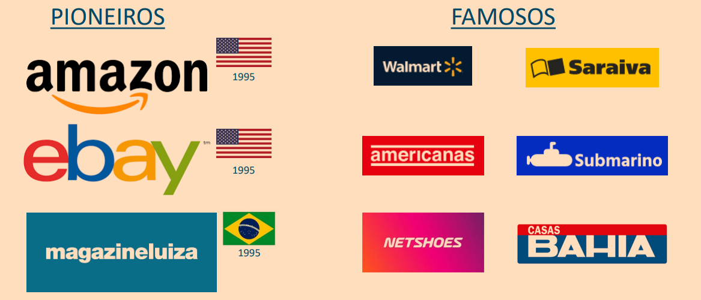
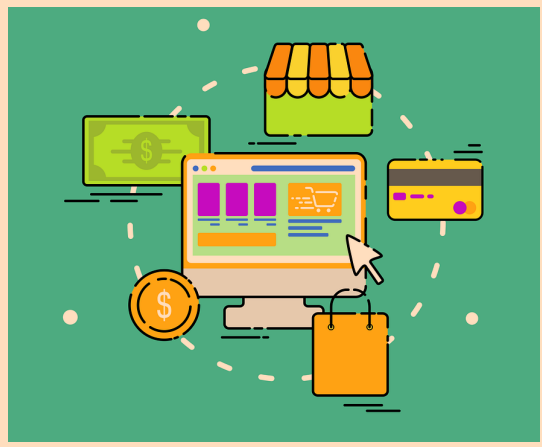
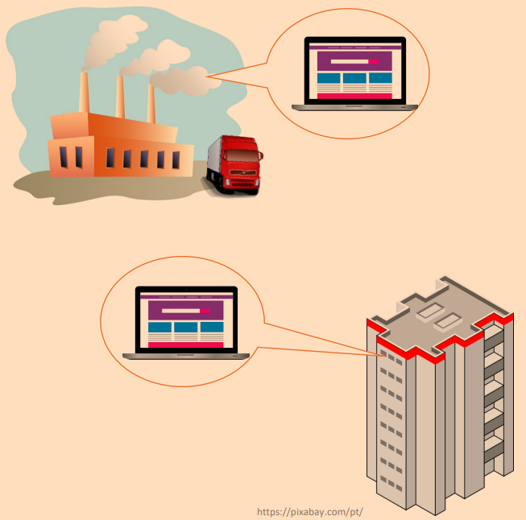
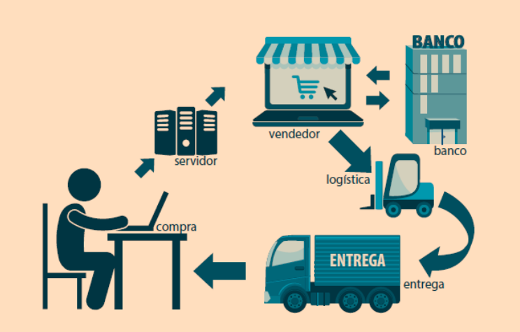
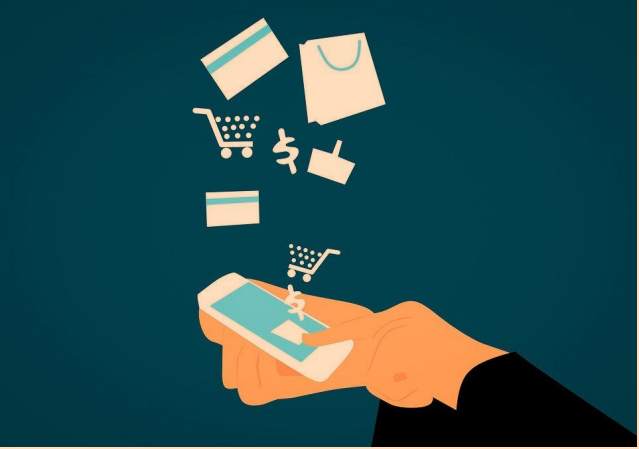

# E-COMMERCE

✓ O Comércio Eletrônico é a realização de
toda a cadeia de valor dos processos de
negócio.

✓ Trabalha em um ambiente eletrônico.

✓ Aplicação intensa uso das tecnologias
de comunicação e da informação.

✓ Busca atender aos objetivos de negócio.

# GRANDES E-COMMERCES

# TIPOS DE E-COMMERCE

## B2C (Business-To-Consumer)

Empresa Vende para Consumidor Final

• Lojas virtuais comuns.

• Layout atraente.

• Experiência do usuário.

• Facilidade de navegação.

## B2B (Business-To-Business)

Empresa Vende para Empresa
Similir ao B2C

### Portal B2B

• Facilitador de transações.

• Diversos fornecedores.

• Cadeia comercial.

• Redução de custos.

• Informações atualizadas.

## C2C (Consumer-to-Consumer)

• Possibilidade de atuar como vendedor e
consumidor.

• Facilidade para encontrar e comparar
diferentes vendedores em um mesmo
lugar.

• Custos de divulgação baixos ou
inexistentes.

• Acesso a recursos de pagamento e
publicidade profissionais.

• Grande comunidade de usuários.

• Alcance nacional e internacional.

## FUNCIONAMENTO DE UM SITE DE COMÉRCIO ELETRÔNICO

# OUTROS TIPOS DE E-COMMERCE

## M-Commerce

• Negociação feita em dispositivos
Mobile.

• Aliado das lojas virtuais.

• Site Responsivo ou App.

• Promoções exclusivas em Apps.

## S-Commerce

• Uso das Redes Sociais para negociação.

• Divulgação dos produtos nas
plataformas.

• Recomendação de amigos.

• Lojas inseridas nas redes.

# PARADIGMAS DO E-COMMERCE

✓ É vantajoso fazer compras pela internet?

✓ É seguro comprar pela internet?

✓ Lojas físicas serão extintas?