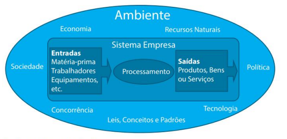
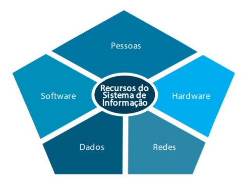
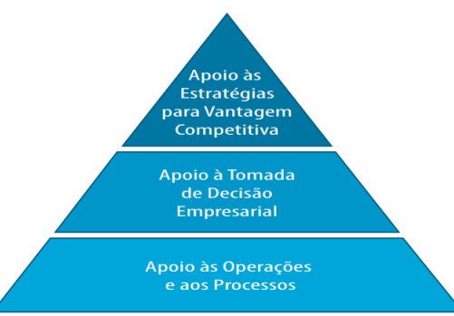

# CONCEITOS E FUNDAMENTOS DE SISTEMAS DE INFORMAÇÃO

- Um sistema não é
simplesmente
um computador que
automatiza tarefas. 

# O QUE É UM SISTEMA

o conjunto estruturado ou
ordenado de partes ou
elementos que se mantêm
em interação, ou
seja, em ação recíproca, na
busca da consecução de
um ou de vários objetivos

As **empresas** devem ser
consideradas **sistemas abertos**, pois necessitam da
constante interação com o
meio no qual estão inseridas,
como forma de se obter
insumos para sua entrada e
oferecer o resultado de sua
saída para ser absorvido e
consumido pelo meio. 

### Modelo de um Sistema Empresarial

# O que são Sistemas de Informação

considerado um conjunto
de componentes ou
módulos interrelacionados que
possibilitam a entrada ou
coleta de dados, seu
processamento e a
geração de informações
necessárias à tomada de
decisões voltadas ao
planejamento,
desenvolvimento e
acompanhamento de
ações.

# Recursos do Sistema de Informação

# Papéis do Sistema de Informação

