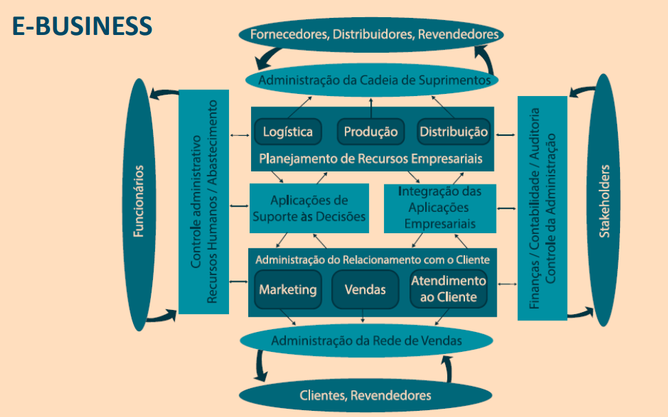

# E-BUSINESS

- Uso de sistemas de
informação e recursos
tecnológicos para apoiar
as transações de
negócios.

# VISÃO GERAL DA ARQUITETURA DE UM E-BUSINESS

# ERP – ENTERPRISE RESOURCE PLANNING PLANEJAMENTO DE RECURSOS EMPRESARIAIS

- O ERP é um sistema
**interfuncional**, que atua
como uma estrutura para
**integrar** os diversos
processos de negócios de
uma empresa.

- Um sistema de informação
que trata a **regra de negócios**
de modo a tornar as
**operações mais confiáveis.**

## Exemplos de Sistemas ERP

# CRM – CUSTOMER RELATIONSHIP MANAGEMENT GERENCIAMENTO DO RELACIONAMENTO COM O CLIENTE

Sistemas com módulos que executam as
atividades relacionadas ao contato com
o cliente, como:

• Atividades de vendas

• Atendimento ao cliente

• Pesquisa de satisfação

• Programa de fidelidade

• Frente de loja

## 1. Como um CRM vai economizar meu tempo?

R: Um enorme benefício do CRM é automatizar as tarefas de
rotina que consomem tempo, economizando horas incontáveis.
Com isso, sobra mais tempo para fazer vendas.

VAMOS A UM EXEMPLO...

### Exemplo de sistema CRM: 

Imagine que você queira enviar o seguimento de um e-mail sobre um
trabalho de marketing:

- Com uma boa solução de CRM, não é preciso lembrar quais leads (contatos)
você quer visar. 

- Você pode simplesmente criar algumas regras para seus leads (contatos) e
automatizar o trabalho de marketing, como campanhas de e-mail e captura
de leads (contatos), para que eles sejam rapidamente direcionados para os
reps (representantes) que vão dar seguimento ou ser promovidos.

- Modelos de e-mail que podem ser criados na solução de CRM garantem que
você não precisa repetir o trabalho ou mesmo recortar e colar

# DIFERENÇAS ENTRE SISTEMAS ERP E CRM

# SISTEMAS FUNCIONAIS

• Automação da Força de Vendas

• Sistemas de Marketing

• Sistemas de Manufatura

• Sistemas de Recursos Humanos

• Sistemas Contábeis

• Sistemas Financeiros
